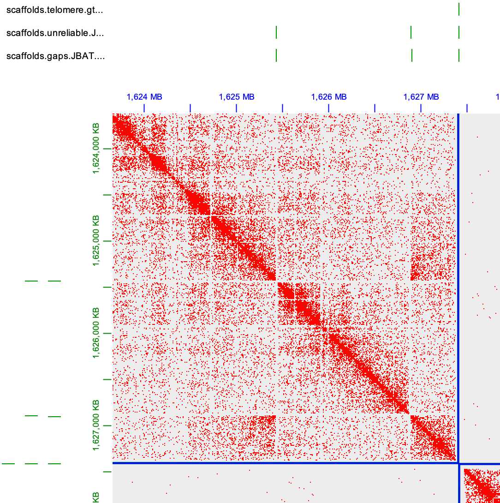
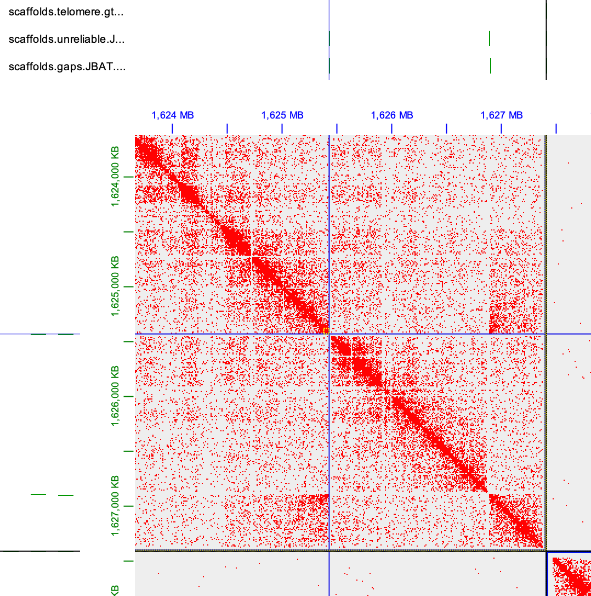
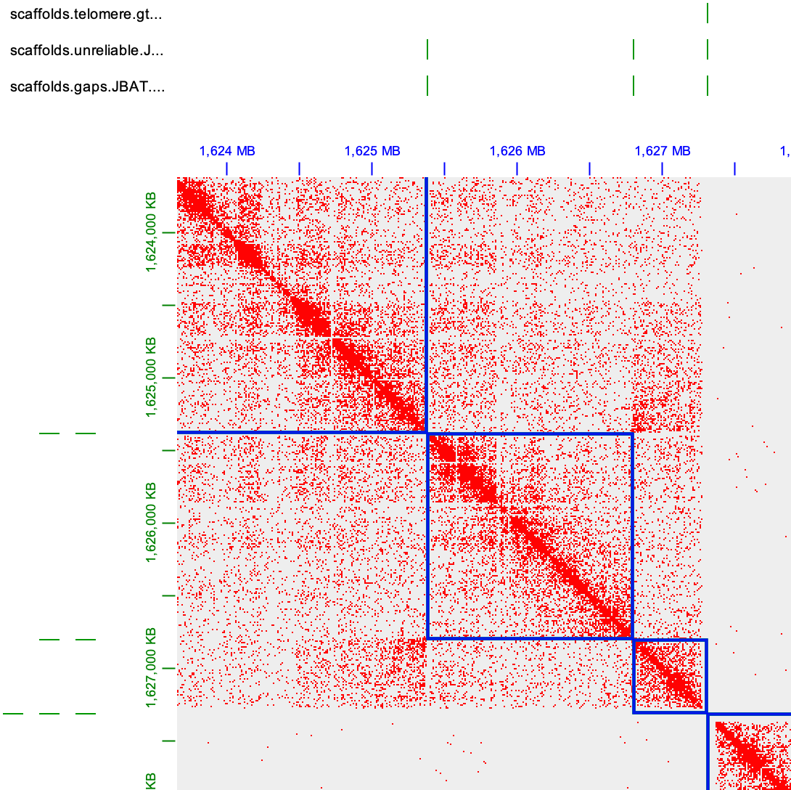
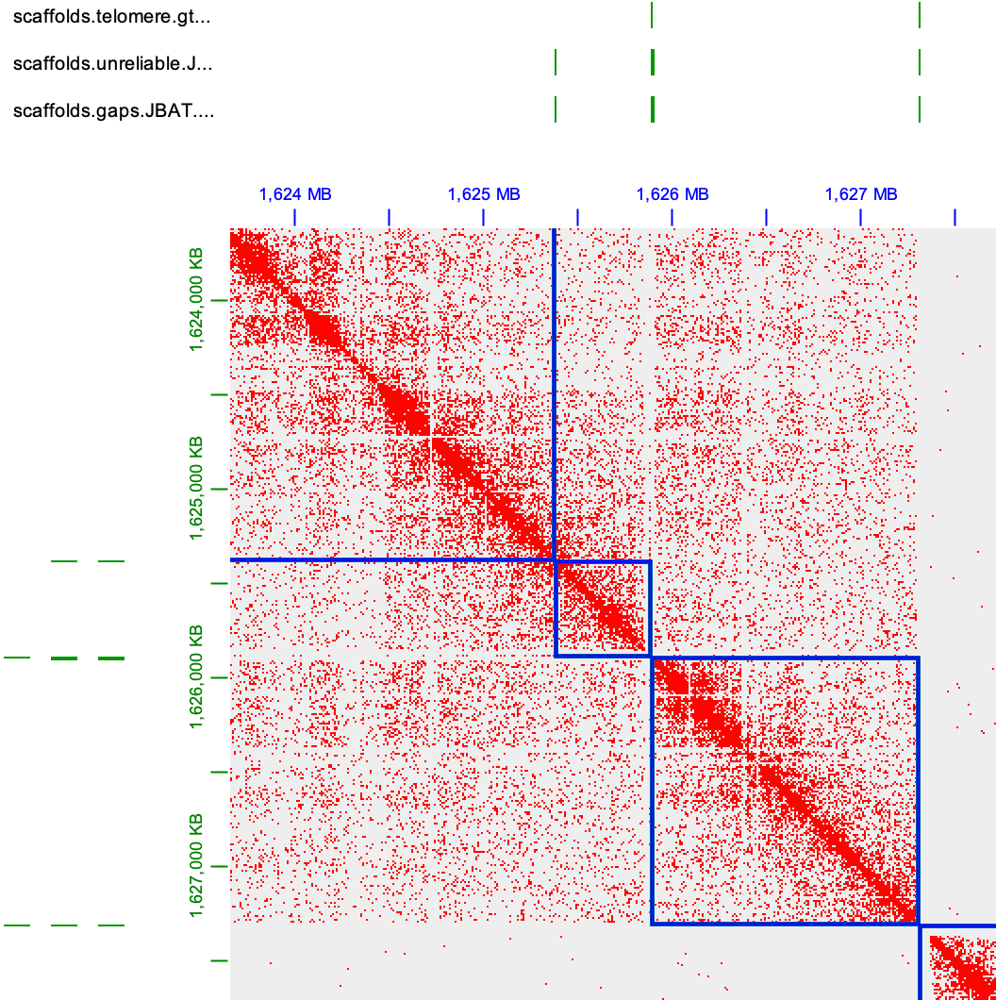
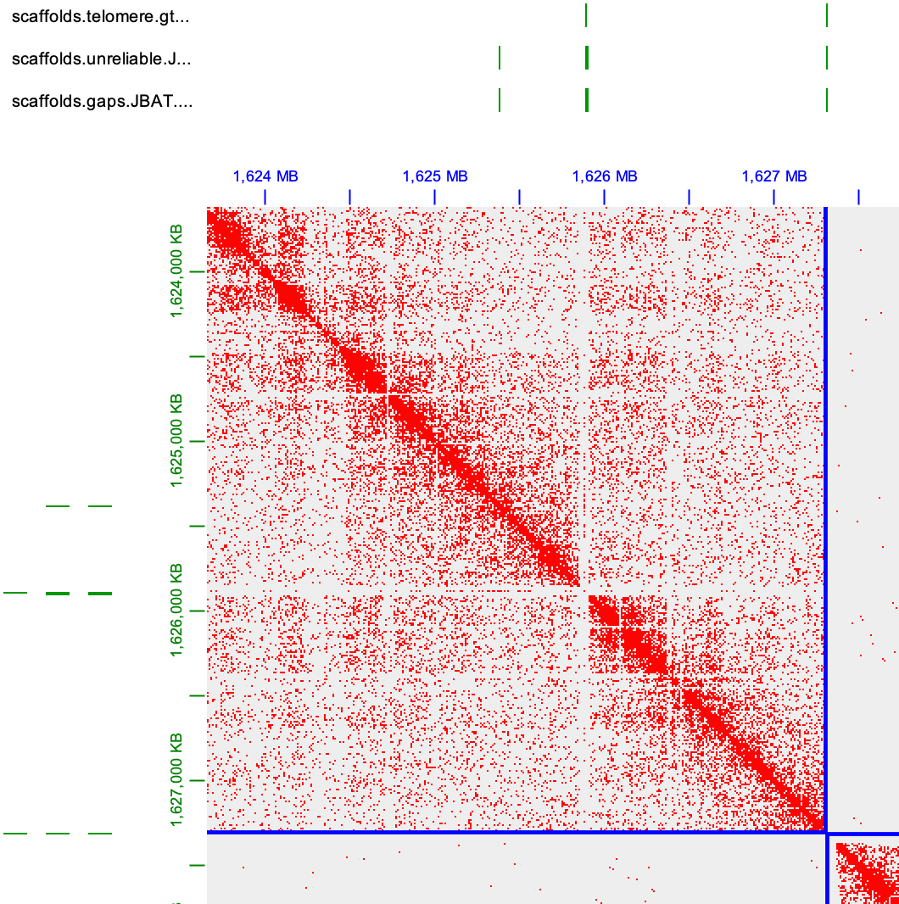
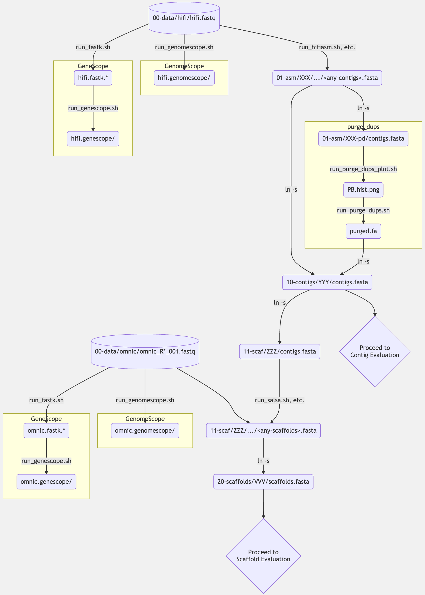
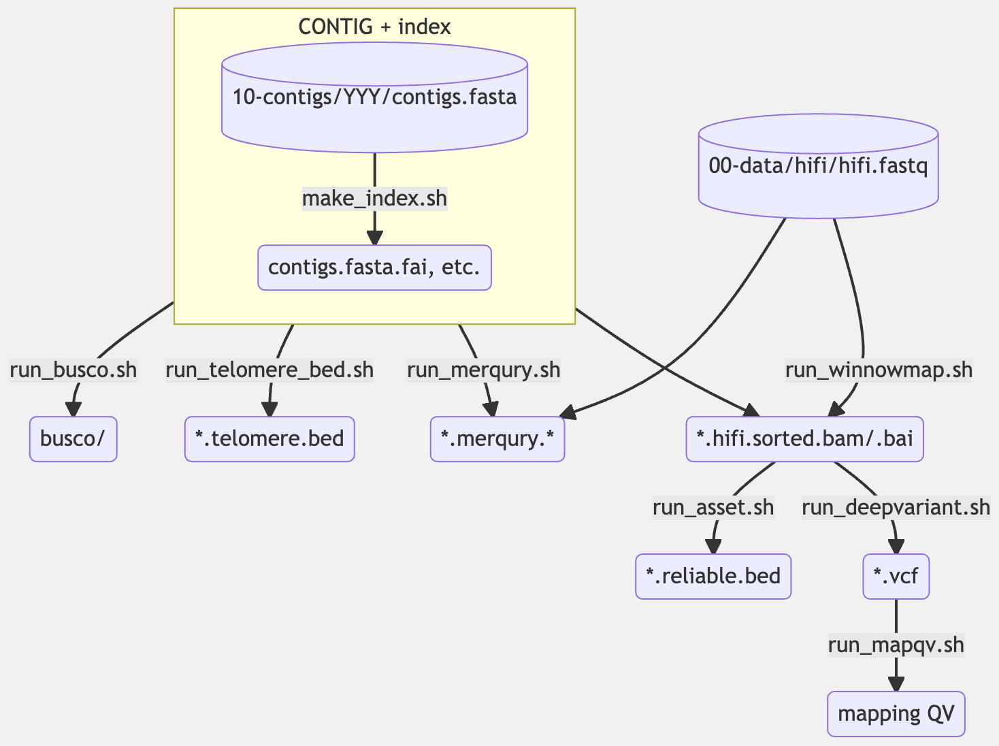
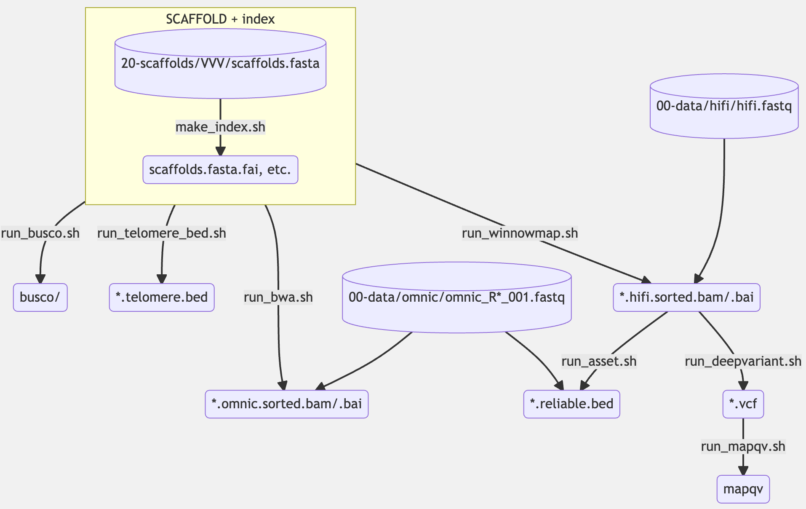

## TODO:

- Make a small test dataset

---

# ant-asm-workflow

- This is a template working directory (`template/` of this repository) containing shell scripts that can be used for semi-automated genome assembly, quality assessment, and manual curation with **HiFi + Omni-C** reads (or only HiFi reads).
- This workflow depends on [the Bioinfo User Group module set](https://github.com/oist/BioinfoUgrp) on [the Deigo HPC cluster](https://groups.oist.jp/scs/documentation) at OIST. You cannot use this workflow as it is outside Deigo, although the commands other than environment settings are universal.
- This workflow supports both **haplotype-merged** assembly and **haplotype-phased** assembly (of a diploid genome).
- The evaluation criteria are basically based on the [VGP](https://github.com/VGP/vgp-assembly)'s method.
- This workflow was originally developed for ants, but it is now applicable to other (diploid) species with a config file (`template/config.sh`) that stores species-specific parameters.

## How to install

There is no need for any "installation" procedure because this workflow is after all merely a collection of bash scripts (plus a simple control of the SLURM job manager). All you need to do is thus clone this repository:

```bash
git clone https://github.com/yoshihikosuzuki/ant-asm-workflow
```

and then copy the `template/` directory in this repository to somewhere you wish to work with a specific sample:

```bash
# NOTE: Assuming <your-working-dir-name> does not exist yet
cp -r ant-asm-workflow/template <your-working-dir-name>
```

The copied directory is the place you run the workflow.

Below we start with an abstract description about the overall structure of the working directory. Then, we provide practical information and commands on how to work with it.

## Directory structure

For each sample to be assembled, we propose the following directory structure to generate and compare different types of assemblies while dividing the tasks in genome assembly.

> :information_source: **IMPORTANT:**
> 
> - Below, those surrounded by `<` `>` are the names up to you or up to tools you used.
> - However, on the other hand, the structure of the directories and the names of the files MUST be exactly the same as described below **except** those surrounded by `<` `>`. DO NOT change them unless you know how everything works.
> - `->` means a symbolic link (made with `$ ln -s`).
> - Multiple directories (e.g. `<assembler-1>/`, `<assembler-2>/`, ..., under `01-asm/`) mean multiple assemblies with different assemblers or different parameters to be compared.

```text
<your-working-dir-name>
├── 00-data/
│   ├── hifi/
│   │    └── hifi.fastq -> <path-to-your-hifi-reads>.fastq
│   │
│   └── omnic/
│        ├── omnic_R1_001.fastq -> <path-to-your-omnic-reads>_R1_001.fastq
│        └── omnic_R2_001.fastq -> <path-to-your-omnic-reads>_R2_001.fastq
│
├── 01-asm/
│   ├── <assembler-1>/
│   │    ├── hifi.fastq -> ../../00-data/hifi/hifi.fastq
│   │        ...
│   │
│   ├── <assembler-2>/
|       ...
│
├── 10-contigs/
│   ├── <assembly-name-1>/
│   │    ├── contigs.fasta -> ../../01-asm/<assembler-N>/<contig-fasta-file>
│   │        ...
│   │
│   ├── <assembly-name-2>/
|       ...
│
├── 11-scaf/
│   ├── <scaf-tool-1>/
│   │    ├── omnic_R1_001.fastq -> ../../00-data/omnic/omnic_R1_001.fastq
│   │    ├── omnic_R2_001.fastq -> ../../00-data/omnic/omnic_R2_001.fastq
│   │    ├── contigs.fasta* -> ../../10-contigs/<assembly-name-N>/contigs.fasta*
│   │        ...
│   │
│   ├── <scaf-tool-2>/
|       ...
│
│── 20-scaffolds/
│   ├── <scaf-name-1>/
│   │    ├── scaffolds.fasta -> ../../11-scaf/<scaf-tool-N>/<scaf-fasta-file>
│   │        ...
│   │
│   ├── <scaf-name-2>/
│       ...
│
└── 21-curation/
    ├── <curation-name-1>/
    │    ├── scaffolds.fasta -> ../../11-scaf/<scaf-tool-N>/output_for_curation/scaffolds.fasta
    │    ├── merged_nodups.txt -> ../../11-scaf/<scaf-tool-N>/output_for_curation/merged_nodups.txt
    │    ├── scaffolds.review.assembly
    │    ├── ...
    │
    ├── <curation-name-2>/
        ....
```

A short description about the role of each directory is as follows:

#### `00-data/`: **Storage and QC of reads**

- Here we store input read datasets (using symlinks as described below), which must consist of the followings:
  - a single FASTQ file (not gzipped) exactly named `hifi.fastq` for HiFi; and
  - two FASTQ files (not gzipped) exactly named `omnic_R1_001.fastq` and `omnic_R2_001.fastq` for Omni-C.
- We also perform QC using GenomeScope+Smudgeplot and FASTK+GeneScope.

#### `01-asm/`: **Contig assembly**

- In each subdirectory, one of the followings is supposed to be performed:
  - a single contig assembly task (e.g. hifiasm, HiCanu) using a symlink to HiFi reads at `00-data/`; or
  - a single purge_dups task using a symlink to an assembled contig FASTA file.

#### `10-contigs/`: **Quality assessment of contigs**

- In each subdirectory, we
  - put a symlink to a single contig FASTA file at `01-asm/`, and
  - assess the quality of the contigs basically based on the criteria proposed by [VGP](https://www.nature.com/articles/s41586-021-03451-0).

#### `11-scaf/`: **Scaffolding**

- In each subdirectory, a single scaffolding task (e.g. SALSA, 3D-DNA) is performed using symlinks to Omni-C reads at `00-data/` and a smylink to a draft contig assembly at `10-contigs/`.
- Contact matrix files (i.e. .hic & .assembly files for Juicebox and .mcool & .chrom_sizes for HiGlass) are also generated for manual inspection and curation.

#### `20-scaffolds/`: **Quality assessment of scaffolds**

- In each subdirectory, we
  - put a symlink to a single scaffold FASTA file at `11-scaf/`,
  - assess the quality of the scaffolds with the VGP criteria, and
  - generate some .bed files useful for manual curation of the assembly.

#### `21-curation/`: **Manual curation**

- In each subdirectory, we generate a curated scaffold FASTA file given a modified .assembly file made with Juicebox (i.e. `scaffolds.review.assembly`). Other required files are also symlinked.

## Contents in the template directory

To automatically generate the directory structure above and to provide scripts for the tools we adopt, we have a ready-made template directory named `template/` in this GitHub repository. The contents in the template directory (except symlinks of data files and marginal scripts for removing intermediate files) are as follows:

```text
template/
|-- config.sh
|-- 00-data
|   |-- hifi
|   |   |-- run_all.sh
|   |   |-- run_fastk.sh
|   |   `-- run_genescope.sh
|   `-- omnic
|       |-- run_all.sh
|       |-- run_fastk.sh
|       `-- run_genescope.sh
|-- 01-asm
|   |-- hicanu
|   |   `-- run_hicanu.sh
|   |-- hifiasm
|   |   `-- run_hifiasm.sh
|   |-- hifiasm-phased
|   |   `-- run_hifiasm.sh
|   |-- ipa
|   |   `-- run_ipa.sh
|   |-- peregrine
|   |   `-- run_peregrine.sh
|   `-- template-purge-dups
|       |-- run_purge_dups.sh
|       `-- run_purge_dups_plot.sh
|-- 10-contigs
|   |-- template
|   |   |-- 00-make_index.sh
|   |   |-- 01-busco
|   |   |   `-- run_busco.sh
|   |   |-- 02-merqury
|   |   |   `-- run_merquryfk.sh
|   |   |-- 02-merquryfk
|   |   |   `-- run_merquryfk.sh
|   |   |-- 04-winnowmap
|   |   |   `-- run_winnowmap.sh
|   |   |-- 05-deepvariant
|   |   |   `-- run_deepvariant.sh
|   |   |-- 06-mapqv
|   |   |   `-- run_mapqv.sh
|   |   |-- 07-asset
|   |   |   `-- run_asset.sh
|   |   |-- output_for_curation
|   |   |-- output_for_stats
|   |   `-- run_all.sh
|   `-- template-phased
|       |-- 00-make_index.sh
|       |-- 01-busco-all
|       |   `-- run_busco.sh
|       |-- 01-busco-hap1
|       |   `-- run_busco.sh
|       |-- 01-busco-hap2
|       |   `-- run_busco.sh
|       |-- 02-merqury
|       |   `-- run_merqury.sh
|       |-- 02-merquryfk
|       |   `-- run_merquryfk.sh
|       |-- 04-winnowmap
|       |   `-- run_winnowmap.sh
|       |-- 05-deepvariant
|       |   `-- run_deepvariant.sh
|       |-- 06-mapqv
|       |   `-- run_mapqv.sh
|       |-- 07-asset
|       |   `-- run_asset.sh
|       |-- 10-mummer
|       |   `-- run_mummer.sh
|       |-- output_for_stats
|       `-- run_all.sh
|-- 11-scaf
|   |-- template-3ddna
|   |   |-- output
|   |   |-- output_for_curation
|   |   `-- run_3ddna.sh
|   |-- template-omnic-partition
|   |   `-- run_omnic_partition.sh
|   `-- template-salsa
|       |-- output
|       |-- output_for_curation
|       `-- run_salsa.sh
|-- 20-scaffolds
|   |-- template
|   |   |-- 00-make_index.sh
|   |   |-- 01-busco
|   |   |   `-- run_busco.sh
|   |   |-- 02-merqury
|   |   |   `-- run_merqury.sh
|   |   |-- 02-merquryfk
|   |   |   `-- run_merquryfk.sh
|   |   |-- 04-winnowmap
|   |   |   `-- run_winnowmap.sh
|   |   |-- 05-deepvariant
|   |   |   `-- run_deepvariant.sh
|   |   |-- 06-mapqv
|   |   |   `-- run_mapqv.sh
|   |   |-- 07-asset
|   |   |   `-- run_asset.sh
|   |   |-- 09-telomere
|   |   |   `-- run_make_telomere_bed.sh
|   |   |-- output_for_curation
|   |   |-- output_for_stats
|   |   `-- run_all.sh
|   `-- template-phased
|       |-- 00-make_index.sh
|       |-- 01-busco-all
|       |   `-- run_busco.sh
|       |-- 01-busco-hap1
|       |   `-- run_busco.sh
|       |-- 01-busco-hap2
|       |   `-- run_busco.sh
|       |-- 02-merqury
|       |   `-- run_merqury.sh
|       |-- 02-merquryfk
|       |   `-- run_merquryfk.sh
|       |-- 04-winnowmap
|       |   `-- run_winnowmap.sh
|       |-- 05-deepvariant
|       |   `-- run_deepvariant.sh
|       |-- 06-mapqv
|       |   `-- run_mapqv.sh
|       |-- 07-asset
|       |   `-- run_asset.sh
|       |-- 09-telomere
|       |   `-- run_make_telomere_bed.sh
|       |-- 10-mummer
|       |   `-- run_mummer.sh
|       |-- output_for_curation
|       |-- output_for_stats
|       `-- run_all.sh
`-- 21-curation
    `-- template
        `-- make_curated_scaffolds.sh
```

## How to work with the template

The workflow is **NOT** (and will never be) fully automatic for many reasons.
That is, you need to run the following commands step-by-step, although most of the steps can be easily executed using ready-made shell scripts.

> :information_source: **IMPORTANT:**
> 
> In the commnds below, you need to replace each name surrounded by `<` `>` (e.g. path to an input data file, name of an assembly) with something up to you. On the other hand, however, you must NOT change the names of the other files/directories.

> :memo: **NOTE:**
> 
> `&&` at the end of a line below means "execute the next command if the previous command finishes successfully." You do not have to add it if you are running each line interactively in a shell.

### 0. Copy the template and make symlinks to input read datasets

```bash
# Assuming <your-working-dir-name> does not exist yet
cp -r <path-to>/ant-asm-workflow/template/ <your-working-dir-name>
cd <your-working-dir-name>
cd 00-data/ &&
    cd hifi/ &&
        ln -sf <path-to-your-hifi-reads>.fastq ./hifi.fastq &&
        cd ..
    cd omnic/ &&
        ln -sf <path-to-your-omnic-reads>_R1_001.fastq ./omnic_R1_001.fastq &&
        ln -sf <path-to-your-omnic-reads>_R2_001.fastq ./omnic_R2_001.fastq &&
        cd ..
cd ..
```

> :memo: **NOTE:**
> 
> You can update the scripts in your working directory while keeping the other files as they are (which is useful when the workflow itself is updated) by:
> ```bash
> # NOTE: <your-working-dir-name> needs to exist
> rsync -auv <path-to>/ant-asm-workflow/template/ <your-working-dir-name>/
> # For example, to update scripts in `10-contigs/<assembly-name>`:
> cd <your-working-dir-name>/10-contigs/
> rsync -auv template/ <assembly-name>/
> ```
> :warning: **WARNING**: Do NOT forget `/` after `template` in the command above.

### 1. Edit the global config file

Some species-dependent (as well as computer-environment-specific) settings are written in a single file, `<your-working-dir-name>/config.sh`, where the default values are for ants.
If you wish to apply this workflow to species other than ants, you need to change them, especially BUSCO's lineage (`hymenoptera_odb10` by default) and telomeric motif sequence (`TTAGG` by default whereas human is `TTAGGG`), as necessary. The most significant parameters are as follows:

|Variable Name|Default Value|Description|
|-|-|-|
|`AUTO_DEL`|`true`|If `true`, intermediate files are deleted after each job|
|`HIC_ENZYME_NAME`||Parameter for 3D-DNA. Empty for Omni-C|
|`BUSCO_DB`|`hymenoptera_odb10`|BUSCO's lineage database name|
|`TELOMERE_MOTIF`|`TTAGG`|For finding telomeres from scaffolds|

### 2. Run GenomeScope and GeneScope for each of HiFi reads and Omni-C reads

```bash
cd 00-data/ &&
    cd hifi/ &&
        sbatch run_all.sh &&   # Will submit several child jobs using SLURM
        cd ..
    cd omnic/ &&
        sbatch run_all.sh &&
        cd ..
cd ..
```

After submitting these jobs, you can **immediately** proceed to the next step 2 (i.e. You do not have to wait for them to finish).

After these jobs (and their child jobs) finish, check the GeneScope plot and the Smudgeplot for each of HiFi and Omni-C:

> :information_source: **IMPORTANT output files in this step for QC:**
> 
>  - `00-data/hifi/`
>    - `hifi.genescope/`: GeneScope for HiFi reads
>      - `summary.txt`: Fitting result
>      - `transformed_linear_plot.png`: k-mer (k=40 by default) count histogram with the fitting
>    - `hifi.genomescope_L*_U*_smudgeplot.png`: Smudgeplot for HiFi reads
>  - `00-data/omnic/`
>    - `omnic.genescope/`: GeneScope for Omni-C reads
>      - `summary.txt`: Fitting result
>      - `transformed_linear_plot.png`: k-mer (k=21 by default) count histogram with the fitting
>    - `omnic.genomescope_L*_U*_smudgeplot.png`: Smudgeplot for Omni-C reads

### 3. Run assemblers (and purge_dups if necessary)

> :warning: **WARNING about purge_dups:**
> 
> You need to run a purge_dups task (not in the directory you ran hifiasm/HiCanu/etc. but) in a separated, new subdirectory right under `01-asm/`, as described just below.

```bash
cd 01-asm/ &&
    # NOTE: <assembler> = hifiasm, hicanu, etc. If you wish to try different parameters with the same assembler, then make a new directory.
    cd <assembler>/ &&
        sbatch run_<assembler>.sh &&
        cd ..
    # To run purge_dups, do the followings after the assembly finishes
    cp -r template-purge-dups/ <assembler>-pd &&
        cd <assembler>-pd &&
        # NOTE: <contig-fasta-file> depends on the assembler
        ln -sf ../<assembler>/<contig-fasta-file> ./contigs.fasta &&
        sbatch run_purge_dups_plot.sh &&
        # After run_purge_dups_plot.sh finishes, here write the values of `L`, `M`, `U` in run_purge_dups.sh based on `PB.hist.plot`
        sbatch run_purge_dups.sh &&
        cd ..
cd ..
```

The `hifiasm-phased` directory is for haplotype-phased assembly, and the others are for haplotype-merged assembly. For a phased assembly, you need to run purge_dups for each of the two haplotype-specific contigs independently.

The assembly stats such as contig N50 length is written at the bottom of the log file, e.g. `hifiasm/hifiasm.log`.

### 4. Evaluate contigs

> :warning: **WARNING:**
> 
> Only a single assembly to be assessed must be placed under each subdirectory. That is, for example, if you wish to evaluate all of the i) primary contigs, ii) purged primary contigs, and iii) primary unitigs generated by the same assembler, then you need to make a distinct directory for each of them.

For a haplotype-merged assembly:

```bash
cd 10-contigs/ &&
    # NOTE: <assembly-name> = an arbitrary name representing an assembly generated in 01-asm/ (i.e. hifiasm, hifiasm-p_ctg, hicanu-pd, etc.)
    cp -r templete/ <assembly-name> &&
        cd <assembly-name> &&
        # NOTE: <contig-fasta-file> = "purged.fa" for those after purge_dups; otherwise, something specific to an assembler
        ln -sf ../../01-asm/<assembly-dir>/<contig-fasta-file> ./contigs.fasta &&
        sbatch run_all.sh &&
        cd ..
cd ..
```

For a haplotype-phased assembly:

```bash
cd 10-contigs/ &&
    cp -r templete-phased/ <assembly-name> &&
        cd <assembly-name> &&
        ln -sf ../../01-asm/<assembly-dir>/<contig-hap1-fasta-file> ./contigs.hap1.fasta &&
        ln -sf ../../01-asm/<assembly-dir>/<contig-hap2-fasta-file> ./contigs.hap2.fasta &&
        sbatch run_all.sh &&
        cd ..
cd ..
```

For each contig assembly, after `run_all.sh` finishes, check i) assembly stats such as contig N50 length, ii) BUSCO score, iii) Merqury QV, iv) mapping QV, and v) reliable block N50:

> :information_source: **IMPORTANT output files in this step for quality metrics (Use `$ cat` to see the results):**
> 
> Haplotype-merged assembly:
>  - `10-contigs/<assembly-name>/output_for_stats/`
>    - `busco_score`: BUSCO result
>    - `merqury_qv`: Merqury's K-mer based QV
>    - `mapping_qv`: Mapping based QV
>    - `reliable_block_n50`: Reliable block N50 length
>
> Haplotype-phased assembly:
>  - `10-contigs/<assembly-name>/output_for_stats/`
>    - `busco_score_hap1`: BUSCO result for haplotype 1 contigs
>    - `busco_score_hap2`: BUSCO result for haplotype 2 contigs
>    - `busco_score_all`: BUSCO result for haplotype 1 + 2 contigs
>    - `merqury_qv`: Merqury's K-mer based QV
>    - `mapping_qv`: Mapping based QV
>    - `reliable_block_n50`: Reliable block N50 length

### 5. Run scaffolding tools

> :warning: **WARNING:**
> 
> A single subdirectory must be only for a single scaffolding task. That is, you must NOT make nested directories like `hifiasm/salsa/` nor `hifiasm/3ddna`. Instead, you need to make `hifiasm-salsa` and `hifiasm-3ddna` right under `11-scaf/`.
> Likewise, if you wish to try different parameters with the same scaffolding tool, then make a new directory.

For a haplotype-merged assembly:

```bash
cd 11-scaf/ &&
    # NOTE: <scaf-tool> = {3ddna, salsa}, <assembly-name> = a directory name in 10-contigs/.
    cp -r template-<scaf-tool>/ <assembly-name>-<scaf-tool> &&
        cd <assembly-name>-<scaf-tool> &&
        ln -sf ../../10-contigs/<assembly-name>/contigs.fasta* . &&   # WARNING: Do not forget * !!!
        sbatch run_<scaf-tool>.sh &&
        cd ..
cd ..
```

For a haplotype-phased assembly, you need to first split the Omni-C reads into two sets of haplotype-specific reads, which can be used for both SALSA and 3D-DNA:

```bash
cd 11-scaf/ &&
    cp -r template-omnic-partition/ <assembly-name>-omnic-partition &&
        cd <assembly-name>-omnic-partition &&
        ln -sf ../../10-contigs/<assembly-name>/contigs.* . &&   # NOTE: contigs.hap* must exist
        sbatch run_partition.sh &&
        cd ..
cd ..
```

and then do scaffolding for each haplotype just like the haplotype-merged assembly using the partitioned Omni-C reads:

```bash
cp -r template-<scaf-tool>/ <assembly-name>-<scaf-tool> &&
    cd <assembly-name>-<scaf-tool> &&
    ln -sf ../../10-contigs/<assembly-name>/contigs.hap<N>.fasta* . &&   # WARNING: Do not forget * !!!
    ln -sf ../<assembly-name>-omnic-partition/omnic_R1_001.hap<N>.fastq omnic_R1_001.fastq &&
    ln -sf ../<assembly-name>-omnic-partition/omnic_R2_001.hap<N>.fastq omnic_R2_001.fastq &&
    sbatch run_<scaf-tool>.sh &&
    cd ..
```

> :information_source: **IMPORTANT output files in this step:**
> 
> For scaffold evaluation (in Step 6):
> - `11-scaf/<scaf-name>/output/`
>   - `scaffolds_FINAL.fasta`: Final scaffolds
>
> For manual curation (in Step 7)::
> - `11-scaf/<scaf-name>/output_for_curation/`
>   - `scaffolds.fasta`: Final scaffolds
>   - `scaffolds.hic`: Omni-C contact matrix editable in Juicebox
>   - `scaffolds.assembly`: Index file for Juicebox
>   - `merged_nodups.txt`: Raw contact information for curated scaffold generation

### 6. Evaluate scaffolds

> :warning: **WARNING:**
> 
> Only one scaffold FASTA per subdirectory, just like above.

For a haplotype-merged assembly:

```bash
cd 20-scaffolds/ &&
    # NOTE: <scaf-name> = an arbitrary name representing an assembly generated in 11-scaf/ (i.e. hifiasm-salsa, hifiasm-pd-3ddna, etc.)
    cp -r templete/ <scaf-name> &&
        cd <scaf-name> &&
        # NOTE: <scaf-fasta-file> depends on the scaffolding tool
        ln -sf ../../11-scaf/<scaf-dir>/<scaf-fasta-file> ./scaffolds.fasta &&
        sbatch run_all.sh &&
        cd ..
cd ..
```

For a haplotype-phased assembly:

```bash
cd 20-scaffolds/ &&
    cp -r templete/ <scaf-name> &&
        cd <scaf-name> &&
        ln -sf ../../11-scaf/<scaf-dir>/<scaf-hap1-fasta-file> ./scaffolds.hap1.fasta && 
        ln -sf ../../11-scaf/<scaf-dir>/<scaf-hap2-fasta-file> ./scaffolds.hap2.fasta && 
        sbatch run_all.sh &&
        cd ..
cd ..
```

For each scaffold assembly, after `run_all.sh` finishes, check i) assembly stats such as scaffold N50 length, ii) BUSCO score, iii) Merqury QV, iv) mapping QV, and v) reliable block N50:

> :information_source: **IMPORTANT output files in this step for quality metrics (Use `$ cat` to see the results):**
>
> For haplotype-merged assembly:
> - `20-scaffolds/<scaf-name>/`
>    - `busco_score`: BUSCO result
>    - `merqury_qv`: Merqury's K-mer based QV
>    - `mapping_qv`: Mapping based QV
>    - `reliable_block_n50`: Reliable block N50 length
>
> For haplotype-phased assembly:
> - `20-scaffolds/<scaf-name>/`
>    - `busco_score_hap1`: BUSCO result for haplotype 1 scaffolds
>    - `busco_score_hap2`: BUSCO result for haplotype 2 scaffolds
>    - `busco_score_all`: BUSCO result for haplotype 1 + 2 scaffolds
>    - `merqury_qv`: Merqury's K-mer based QV
>    - `mapping_qv`: Mapping based QV
>    - `reliable_block_n50`: Reliable block N50 length

Along with these qualty metrics, we generate several .bed files compatible (only) for Juicebox to help manual curation:
  
> :information_source: **IMPORTANT output files in this step for manual curation (in Step 7):**
> 
>  - `20-scaffolds/<scaf-name>/output_for_curation/`
>    - `scaffolds[.hap<N>].gaps.JBAT.bed`: Locations of sequence gaps (= `N` bases) between contigs
>    - `scaffolds[.hap<N>].unreliable.JBAT.bed`: Locations of unreliable regions (where read coverage is very low)
>    - `scaffolds[.hap<N>].telomere.filtered.JBAT.bed`: Locations of long tandem arrays of telomeric motifs

### 7. Manual curation using Juicebox (JBAT)

**Input files**:

- `11-scaf/<scaf-name>/output_for_curation/`
  - `scaffolds.hic`: Hi-C contact matrix (per haplotype if haplotype-phased assembly)
  - `scaffolds.assembly`: Hi-C index file (per haplotype if haplotype-phased assembly)
- `20-scaffolds/<scaf-name>/output_for_curation/`
  - `scaffolds[.hap<N>].gaps.JBAT.bed`: Sequence gaps
  - `scaffolds[.hap<N>].unreliable.JBAT.bed`: Unreliable regions
  - `scaffolds[.hap<N>].telomere.filtered.JBAT.bed`: Long telomere arrays

**Steps:**

1. Load the `.hic` and `.assembly` files in JBAT.
2. Load the `.bed` files of sequence gaps, unreliable regions, and tandem arrays as 1D tracks (via `View` → `Show Annotation Panel` → `Add Local`).
3. Turn on `Enable straight edge` via Right mouse click.
4. Fix the assembly if there is a breakpoint of contacts. If the breakpoint is a sequence gap and/or unreliable region, the cutting location should be at that position in most cases.
5. After modifying the assembly, save the reviewed `.assembly` file and run the following commands:


```bash
cd 21-curation/ &&
    cp -r templete/ <curation-name> &&
        cd <curation-name> &&
        ln -sf ../../11-scaf/<scaf-dir>/output_for_curation/* . &&
        mv <your-reviewed-assembly> scaffolds.review.assembly &&
        sbatch run_curation.sh &&
        cd ..
cd ..
```

This will generate `scaffolds.FINAL.fasta`, which contains curated scaffolds.

**Example of JBAT manipulation:**



1. There exist two contact breakpoints at sequence gaps.



2. Cut the scaffold at the first breakpoint so that it is exactly at the sequence gap.



3. Cut the other location in the same manner.



4. Translocate the third block to the second.



5. Concatenate the blocks. Telomere motifs are now not located at the chromosome end. Telomere motifs can be found in the middle of a chromosome as well, so this might be no problem, but there also might be a further improvement.

## Visual dependencies among the files and commands in the workflow

### 1. Assembly and scaffolding



### 2. Contig assembly evaluation



### 3. Scafold assembly evaluation


