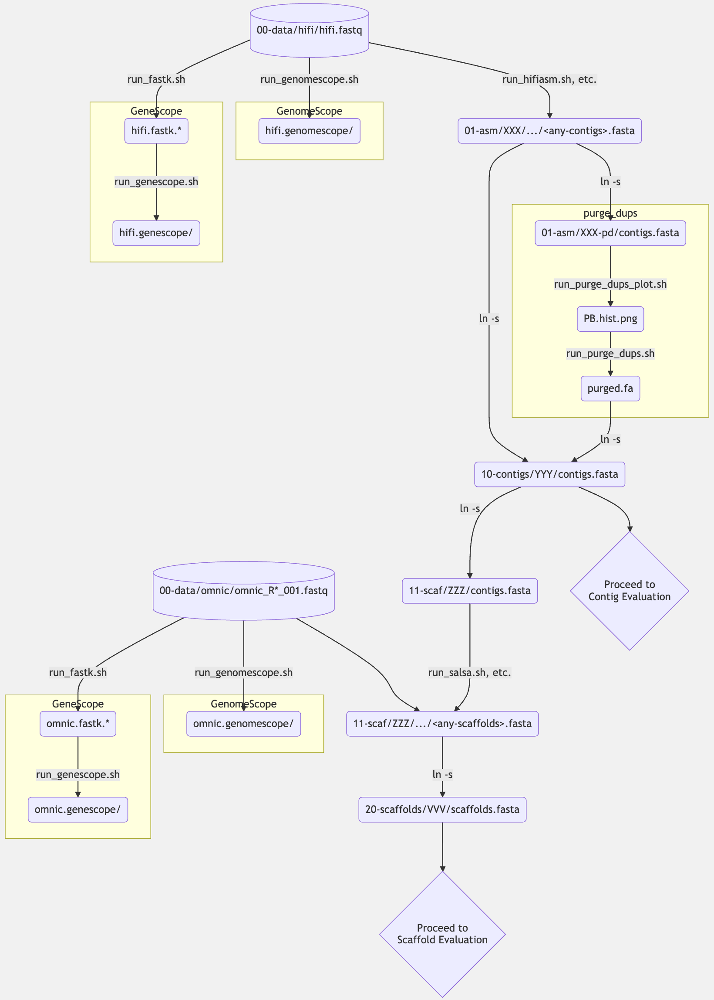
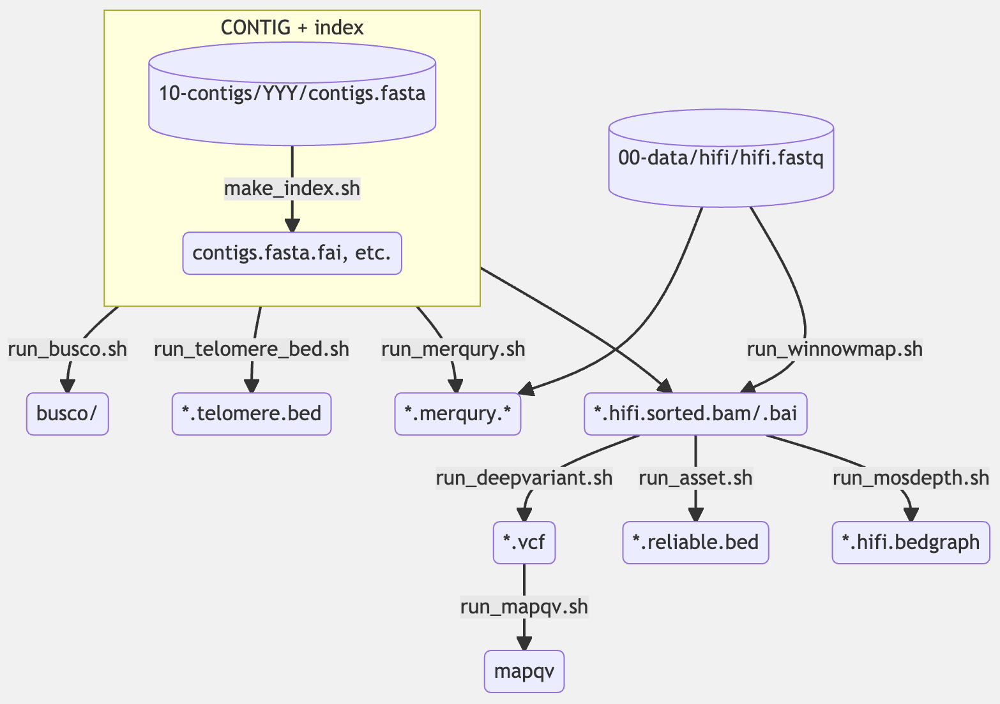
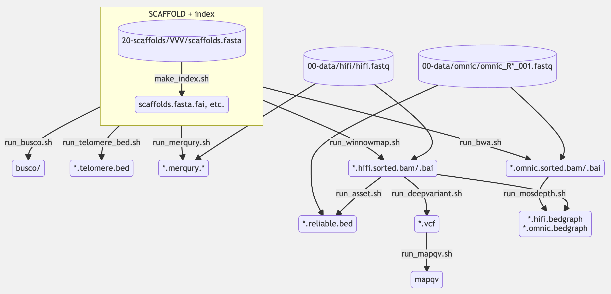

# ant-asm-workflow

Scripts and template working directory for genome assembly with HiFi + Omni-C. Currently, our goal is haplotype-merged assembly.

- [Workflow google doc](https://docs.google.com/document/d/12-pf9O7lHs2xxj6XQZjtEVPWICHrmc37GXqrOut-2AI/edit)
- [Stats goole sheet](https://docs.google.com/spreadsheets/d/1d9j-m88aHG6rK9bzatN4KyjZq6pDtYoDzsfgAdjD3Uk/edit)
- [Figures and tables doc](https://docs.google.com/document/d/1RwdPGJw9Yg86xsIoVGdsSVKAvT0edEfBFF1_wNOHt7A/edit)

Below we

1. introduce the overall structure of the working directory for assembly, scaffolding, and evaluation that we propose,
2. provide information on the template of the working directory with ready-made scripts (`template/` of this repository),
3. describe how to work with the template, and 
4. show an example flow of the steps to do.

**IMPORTANT: The structure of the directories and the names of the files MUST be exactly the same as described below (except e.g. `/path/to/...`, `XXX`, and those surrounded by `<` `>`). DO NOT change them unless you know how everything works.**

**WARNING: Some values hard-coded in scripts in the template directory are specific to ants (e.g BUSCO's lineage is `hymenoptera_odb10` and telomeric motif sequence is `TTAGG`, not `TTAGGG`). Change them as necessary if you wish to use it for different creatures.**

## Directory structure

For each species, we assume the following directory structure to generate different types of assemblies:

```
<working-dir-for-your-species>
├── 00-data/
│   ├── hifi/
│   │    └── hifi.fastq
│   │
│   └── omnic/
│        ├── omnic_R1_001.fastq
│        └── omnic_R2_001.fastq
│
├── 01-asm/
│   ├── <assembly-1>/
│   │    ├── hifi.fastq -> ../../00-data/hifi/hifi.fastq
│   │        ...
│   │
│   ├── <assembly-2>/
|       ...
│
├── 10-contigs/
│   ├── <contig-set-1>/
│   │    ├── contigs.fasta -> ../../01-asm/<assembly-N>/<contig-fasta-file>
│   │        ...
│   │
│   ├── <contig-set-2>/
|       ...
│
├── 11-scaf/
│   ├── <scaffolding-1>/
│   │    ├── omnic_R1_001.fastq -> ../../00-data/omnic/omnic_R1_001.fastq
│   │    ├── omnic_R2_001.fastq -> ../../00-data/omnic/omnic_R2_001.fastq
│   │    ├── contigs.fasta* -> ../../10-contigs/<contig-set-N>/contigs.fasta*
│   │        ...
│   │
│   ├── <scaffolding-2>/
|       ...
│
└── 20-scaffolds/
    ├── <scaffold-set-1>/
    │    ├── scaffolds.fasta -> ../../11-scaf/<scaffolding-N>/<scaf-fasta-file>
    │        ...
    │
    ├── <scaffold-set-2>/
        ...
```

Short description about the role of each directory:

- `00-data/`
  - We store input read datasets, which must consist of the followings:
    - a single FASTQ file exactly named `hifi.fastq` for HiFi; and
    - two FASTQ files exactly named `omnic_R1_001.fastq` and `omnic_R2_001.fastq` for Omni-C.
    - (NOTE: Use symlinks as described below.)
  - QC using GenomeScope+Smudgeplot and FASTK+GeneScope are performed for each of them.
- `01-asm/`
  - In each subdirectory, we perform
    - a single contig assembly task (e.g. hifiasm, HiCanu) using symlinks to input reads at `00-data/`, or
    - a single purge_dups task using symlink to an assembled contig FASTA file.
- `10-contigs/`
  - In each subdirectory,
    - A FASTA file of contigs generated by a single assembly method is placed (using symlink to `01-asm/`).
    - With the contig set, we generate index files (e.g. `samtools index` and `bwa index`) and evaluate the assembly based on the criteria proposed by [VGP](https://www.nature.com/articles/s41586-021-03451-0).
- `11-scaf/`
  - In each subdirectory, we perform a single scaffolding task (e.g. SALSA, 3D-DNA) using symlinks to input reads at `00-data/` and a draft assembly at `10-contigs/`.
- `20-scaffolds/`
  - Almost same as `10-contigs/`.
  - In each subdirectory,
    - A FASTA file of scaffolds generated by a single scaffolding method is placed (using symlink to `11-scaf/`).
    - With the scaffold set, we generate index files and evaluate the assembly.

## Using template directory

To automatically generate the directory structure above and to provide scripts to run several tools, we have a ready-made template directory named `template/`. The contents in the template directory (except symlinks) are the following:

```
template/
├── 00-data
│   ├── hifi
│   │   ├── run_fastk.sh
│   │   ├── run_genescope.sh
│   │   └── run_genomescope.sh
│   └── omnic
│       ├── run_fastk.sh
│       ├── run_genescope.sh
│       └── run_genomescope.sh
├── 01-asm
│   ├── hicanu
│   │   └── run_hicanu.sh
│   ├── hifiasm
│   │   └── run_hifiasm.sh
│   ├── ipa
│   │   └── run_ipa.sh
│   ├── peregrine
│   │   └── run_peregrine.sh
│   └── template-purge-dups
│       ├── run_purge_dups_plot.sh
│       └── run_purge_dups.sh
├── 10-contigs
│   └── template
│       ├── 01-busco
│       │   └── run_busco.sh
│       ├── 02-merqury
│       │   └── run_merqury.sh
│       ├── 04-winnowmap
│       │   └── run_winnowmap.sh
│       ├── 05-deepvariant
│       │   └── run_deepvariant.sh
│       ├── 06-mapqv
│       │   └── run_mapqv.sh
│       ├── 07-asset
│       │   └── run_asset.sh
│       ├── 09-telomere
│       │   └── run_make_telomere_bed.sh
│       └── make_index.sh
├── 11-scaf
│   ├── template-3ddna
│   │   └── run_3ddna.sh
│   └── template-salsa
│       └── run_salsa.sh
└── 20-scaffolds
    └── template
        ├── 01-busco
        │   └── run_busco.sh
        ├── 02-merqury
        │   └── run_merqury.sh
        ├── 03-bwa
        │   └── run_bwa.sh
        ├── 04-winnowmap
        │   └── run_winnowmap.sh
        ├── 05-deepvariant
        │   └── run_deepvariant.sh
        ├── 06-mapqv
        │   └── run_mapqv.sh
        ├── 07-asset
        │   └── run_asset.sh
        ├── 09-telomere
        │   └── run_make_telomere_bed.sh
        └── make_index.sh
```

## How to use

The workflow is **NOT** (and will never be) fully automatic for many reasons. You need to do the followings step-by-step.

NOTE: Variables and parameters written in the scripts can be (and should be) modified as necessary (These are usually mentioned in the comments between the commands below).

NOTE: Each directory containing shell script(s) has symlinks to input data files. Confirm all the symlinks are valid (i.e. pointing to files that indeed exist) before running the scripts.

**IMPORTANT: Some of the scripts can be independently executed in parallel, but some cannot be. To check it, see the dependency relationship depicted in the next section.**

### 0. Copy the template directory and scripts

```bash
# Copy the template directory
cp -r /path/to/ant-asm-workflow/template/ <your_working_dir> &&
    cd <your_working_dir>

# Make symlinks to input read datasets
cd 00-data/hifi/ &&
    ln -sf /path/to/<your-hifi-reads>.fastq ./hifi.fastq &&
    cd ../..
cd 00-data/omnic/ &&
    ln -sf /path/to/<your-omnic-reads>_R1_001.fastq ./omnic_R1_001.fastq &&
    ln -sf /path/to/<your-omnic-reads>_R2_001.fastq ./omnic_R2_001.fastq &&
    cd ../..
```

### 1. Run GenomeScope and GeneScope

```bash
cd 00-data/
cd hifi/ &&
    ./run_fastk.sh &&   # NOTE: You can also use `sbatch` to submit the script.
    ./run_genescope.sh &&   # NOTE: GeneScope depends on FASTK. Do NOT run this script until run_fastk.sh finishes.
    ./run_genomescope.sh &&
    cd ..
cd omnic/ &&
    ./run_fastk.sh &&
    ./run_genescope.sh &&
    ./run_genomescope.sh &&
    cd ..
cd ..
```

### 2. Run assemblers (and purge_dups)

WARN: Single purge_dups task is performed (not in the directory you ran hifiasm/HiCanu but) in a separated, new subdirectory right under `01-asm/`, as follows.

```bash
cd 01-asm/
cd XXX/ &&   # NOTE: XXX = hifiasm, hicanu, etc. If you wish to try different parameters with the same assembler, then make a new directory.
    ./run_XXX.sh &&
    cd ..
# To run purge_dups, do the followings
cp -r template-purge-dups/ XXX-pd &&   # NOTE: XXX = hifiasm, hicanu, etc.
    cd XXX-pd &&
    ln -sf ../XXX/<contig-fasta-file> ./contigs.fasta &&   # NOTE: <contig-fasta-file> depends on the assembler
    ./run_purge_dups_plot.sh &&
    # Here, set the values of `L`, `M`, `U` in run_purge_dups.sh based on the shape of `PB.hist.plot`
    ./run_purge_dups.sh &&
    cd ..
cd ..
```

### 3. Evaluate contigs

WARN: Only one contig FASTA file to be assessed must be placed under each subdirectory. That is, for example, if you wish to evaluate both `*.p_ctg.fasta` and `p_utg.fasta` generated from the same sample with hifiasm, then you need to make a distinct directory for each of them.

```bash
cd 10-contigs/
cp -r templete/ YYY &&   # NOTE: YYY is an arbitrary name representing an assembly generated in 01-asm/ (i.e. hifiasm, hifiasm-p_ctg, hicanu-pd, etc.)
    cd YYY &&
    ln -sf ../../01-asm/path/to/<contig-fasta-file> ./contigs.fasta &&   # NOTE: <contig-fasta-file> = "purged.fa" for those after purge_dups; otherwise, same as that in step 2
    ./make_index.sh &&
    cd 01-busco/ && ./run_busco.sh && cd .. &&
    cd 02-merqury/ && ./run_merqury.sh && cd .. &&
    # Same applies to the remainings (i.e. 03-xxx, 04-xxx, ...)
    cd ..
cd ..
```

### 4. Run scaffolding tools

WARN: One subdirectory must be for only a single scaffolding task. That is, you must NOT make nested directories like `hifiasm/salsa/` nor `hifiasm/3ddna`. Instead, you need to make `hifiasm-salsa` and `hifiasm-3ddna` right under `11-scaf/`.

```bash
cd 11-scaf/
cp -r template-WWW/ YYY-WWW &&   # NOTE: WWW = {3ddna, salsa}, YYY = a directory name in 10-contigs/
    cd YYY-WWW &&
    ln -sf ../../10-contigs/YYY/contigs.fasta* . &&   # NOTE: Do not forget * !!!
    ./run_WWW.sh &&
    cd ..
cd ..
```

### 5. Evaluate scaffolds

WARN: One scaffold FASTA per subdirectory, just like above.

```bash
cd 20-scaffolds/
cp -r templete/ ZZZ &&   # NOTE: ZZZ is an arbitrary name representing an assembly generated in 11-scaf/ (i.e. hifiasm-salsa, hifiasm-pd-3ddna, etc.)
    cd ZZZ &&
    ln -sf ../../11-scaf/path/to/<scaf-fasta-file> ./scaffolds.fasta &&   # NOTE: <scaf-fasta-file> depends on the scaffolding tool
    ./make_index.sh &&
    cd 01-busco/ && ./run_busco.sh && cd .. &&
    cd 02-merqury/ && ./run_merqury.sh && cd .. &&
    # Same applies to the remainings (i.e. 03-xxx, 04-xxx, ...)
    cd ..
cd ..
```

## Visual dependencies among the files and commands above

Based on these flow charts, you can simultaneously run multiple scripts in parallel if they are independent of each other.

### 1. Assembly and scaffolding



### 2. Contig assembly evaluation



### 3. Scafold assembly evaluation



## Example of the overall flow

1. Run the followings in parallel:
   1. For each of the HiFi dataset and Omni-C dataset, run GeneScope and GenomeScope in parallel.
   2. Run contig assemblies (with hifiasm, HiCanu, etc.) using HiFi reads in parallel.
2. Check GeneScope plot, GenomeScope plot, and Smudgeplot as QC of HiFi/Omni-C reads.
3. Run purge_dups for each of the contig assemblies in parallel.
4. Assess the quality of each contig assembly in parallel:
   1. Run make_index, BUSCO, Merqury, and make_telomere_bed in parallel.
   2. After make_index finishes, run winnowmap.
   3. After winnowmap finishes, run DeepVariant and asset in parallel.
   4. After DeepVariant finishes, run mapqv.
5. For each contig assembly, check assembly stats (such as contig N50), BUSCO score, Merqury QV, mapping QV, and reliable block N50, and pick up some contig assemblies that have the highest qualities.
6. For each of the high-quality contig assemblies, run scaffolding tools (with SALSA, 3D-DNA, etc.) in parallel.
7. Assess the quality of each scaffold assembly in parallel:
   1. Run make_index, BUSCO, Merqury, and make_telomere_bed in parallel.
   2. After make_index finishes, run winnowmap, bwa in parallel.
   3. After winnowmap finishes, run DeepVariant and asset in parallel.
   4. After DeepVariant finishes, run mapqv.

## Yoshi TODO memo

- Generate .mcool (after scaffolding or after bwa?)
- Create make_centromere_bed
