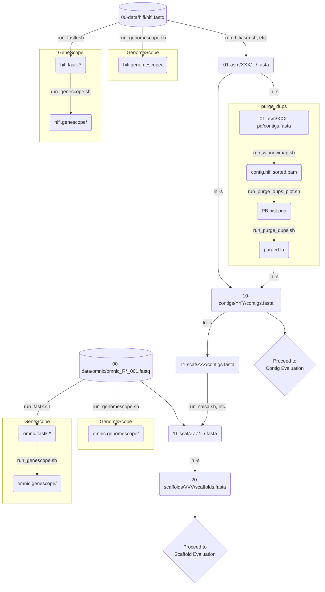

```mermaid
graph TD

HIFI[(00-data/hifi/hifi.fastq)]
OMNI[(00-data/omnic/omnic_R*_001.fastq)]

subgraph e1 [GeneScope]
HIFI_FASTK(hifi.fastk.*)
HIFI_GENESCOPE(hifi.genescope/)
end
subgraph o1 [GenomeScope]
HIFI_GENOMESCOPE(hifi.genomescope/)
end

subgraph e2 [GeneScope]
OMNI_FASTK(omnic.fastk.*)
OMNI_GENESCOPE(omnic.genescope/)
end
subgraph o2 [GenomeScope]
OMNI_GENOMESCOPE(omnic.genomescope/)
end

CONTIG("01-asm/XXX/.../<any-contigs>.fasta")
subgraph purge_dups
CONTIG_PD_SYM("01-asm/XXX-pd/contigs.fasta")
CONTIG_PAF(contig.hifi.sorted.bam)
PD_PLOT(PB.hist.png)
CONTIG_PD(purged.fa)
end

SCAF("11-scaf/ZZZ/.../<any-scaffolds>.fasta")
CONTIG_SYM -->|ln -s| CONTIG_SYMSYM

CONTIG_SYMSYM -->|run_salsa.sh, etc.| SCAF

SCAF_SYM("20-scaffolds/VVV/scaffolds.fasta")
SCAF_EVAL{"Proceed to<br>Scaffold Evaluation"}

CONTIG_SYM(10-contigs/YYY/contigs.fasta)
CONTIG_SYMSYM(11-scaf/ZZZ/contigs.fasta)
CONTIG_EVAL{"Proceed to<br>Contig Evaluation"}


HIFI -->|run_fastk.sh| HIFI_FASTK
HIFI_FASTK -->|run_genescope.sh| HIFI_GENESCOPE
HIFI -->|run_genomescope.sh| HIFI_GENOMESCOPE

OMNI -->|run_fastk.sh| OMNI_FASTK
OMNI_FASTK -->|run_genescope.sh| OMNI_GENESCOPE
OMNI -->|run_genomescope.sh| OMNI_GENOMESCOPE

HIFI -->|run_hifiasm.sh, etc.| CONTIG
CONTIG -->|ln -s| CONTIG_SYM

CONTIG -->|ln -s| CONTIG_PD_SYM
CONTIG_PD_SYM -->|run_winnowmap.sh| CONTIG_PAF
CONTIG_PAF -->|run_purge_dups_plot.sh| PD_PLOT
PD_PLOT -->|run_purge_dups.sh| CONTIG_PD
CONTIG_PD -->|ln -s| CONTIG_SYM

CONTIG_SYM --> CONTIG_EVAL

OMNI --> SCAF

SCAF -->|ln -s| SCAF_SYM
SCAF_SYM --> SCAF_EVAL

```