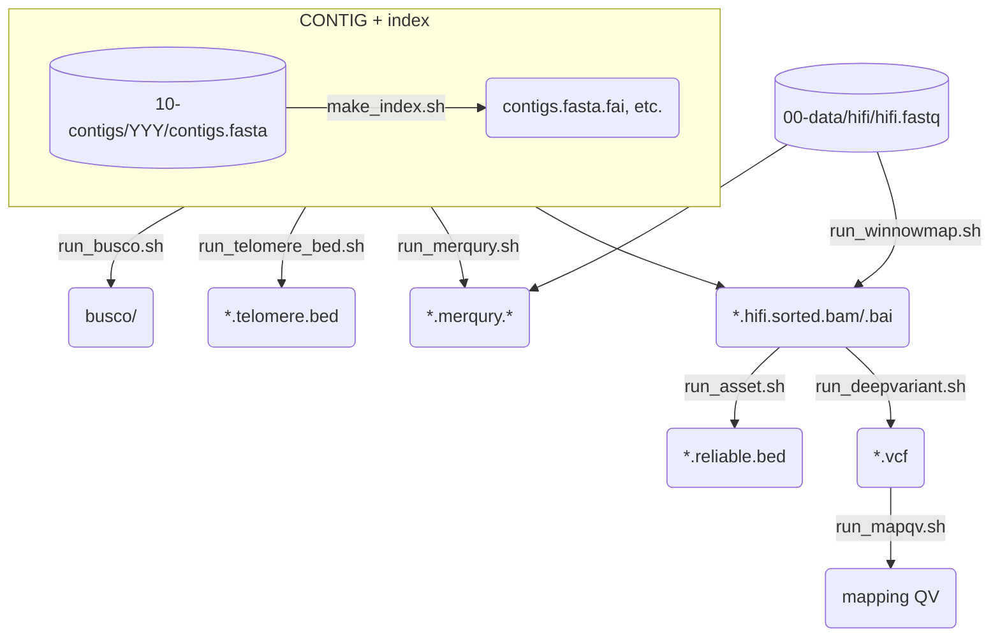

```mermaid
flowchart TD

subgraph CONTIG ["CONTIG + index"]
_CONTIG[(10-contigs/YYY/contigs.fasta)]
INDEX("contigs.fasta.fai, etc.")
_CONTIG -->|make_index.sh| INDEX
end

BUSCO(busco/)
CONTIG -->|run_busco.sh| BUSCO

TELOMERE(*.telomere.bed)
CONTIG -->|run_telomere_bed.sh| TELOMERE

HIFI[(00-data/hifi/hifi.fastq)]

MERQURY(*.merqury.*)
CONTIG -->|run_merqury.sh| MERQURY
HIFI --> MERQURY

WINNOWMAP("*.hifi.sorted.bam/.bai")
CONTIG --> WINNOWMAP
HIFI -->|run_winnowmap.sh| WINNOWMAP

ASSET(*.reliable.bed)
WINNOWMAP -->|run_asset.sh| ASSET

DEEPVARIANT(*.vcf)
WINNOWMAP-->|run_deepvariant.sh| DEEPVARIANT

MAPQV(mapping QV)
DEEPVARIANT -->|run_mapqv.sh| MAPQV

```
