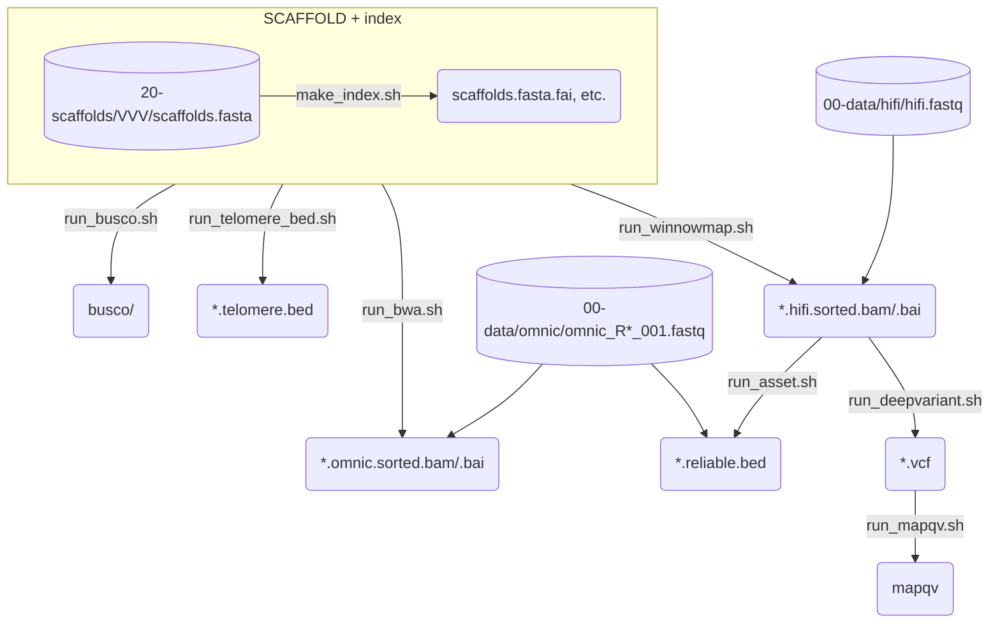

```mermaid
flowchart TD

subgraph SCAF ["SCAFFOLD + index"]
_SCAF[("20-scaffolds/VVV/scaffolds.fasta")]
INDEX("scaffolds.fasta.fai, etc.")
_SCAF -->|make_index.sh| INDEX
end

BUSCO(busco/)
SCAF -->|run_busco.sh| BUSCO

TELOMERE(*.telomere.bed)
SCAF -->|run_telomere_bed.sh| TELOMERE

HIFI[(00-data/hifi/hifi.fastq)]

OMNI[(00-data/omnic/omnic_R*_001.fastq)]

BWA("*.omnic.sorted.bam/.bai")
SCAF -->|run_bwa.sh| BWA
OMNI --> BWA

ASSET(*.reliable.bed)
WINNOWMAP -->|run_asset.sh| ASSET
OMNI -->ASSET

WINNOWMAP("*.hifi.sorted.bam/.bai")
SCAF -->|run_winnowmap.sh| WINNOWMAP
HIFI --> WINNOWMAP

DEEPVARIANT(*.vcf)
WINNOWMAP-->|run_deepvariant.sh| DEEPVARIANT

MAPQV(mapqv)
DEEPVARIANT -->|run_mapqv.sh| MAPQV

```